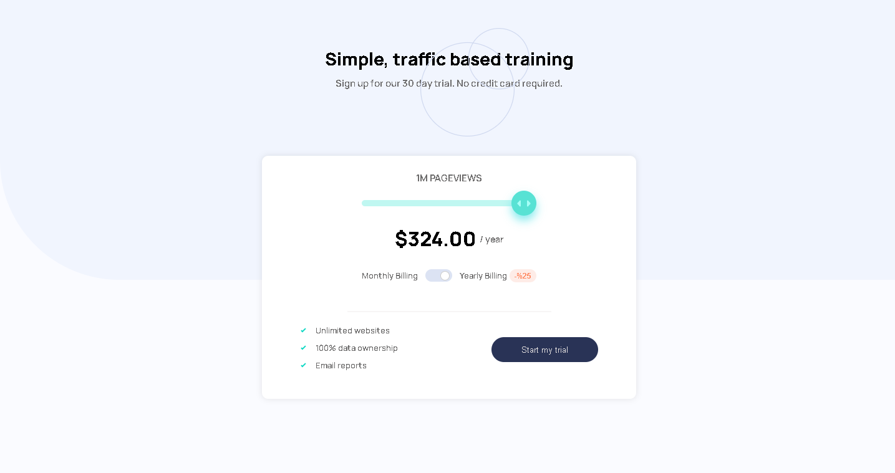
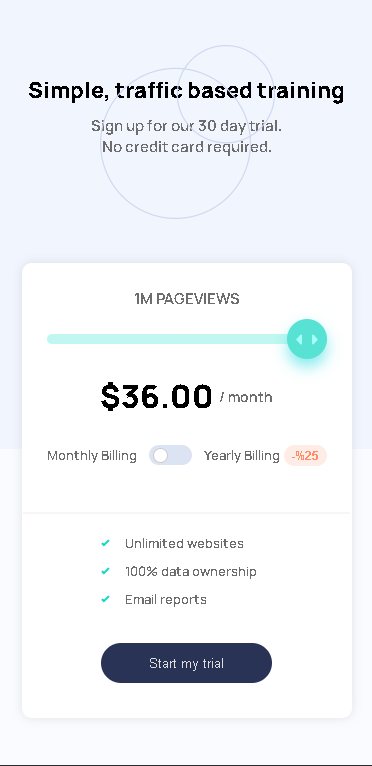

# Interactive-pricing-component

# Frontend Mentor - Interactive pricing component solution

This is a solution to the [Interactive pricing component challenge on Frontend Mentor](https://www.frontendmentor.io/challenges/interactive-pricing-component-t0m8PIyY8). Frontend Mentor challenges help you improve your coding skills by building realistic projects. 

## Table of contents

- [Overview](#overview)
  - [The challenge](#the-challenge)
  - [Screenshot](#screenshot)
  - [Links](#links)
- [My process](#my-process)
  - [Built with](#built-with)
  - [What I learned](#what-i-learned)
  - [Continued development](#continued-development)
  - [Useful resources](#useful-resources)
- [Author](#author)


## Overview

### The challenge

Users should be able to:

- View the optimal layout for the app depending on their device's screen size
- See hover states for all interactive elements on the page
- Use the slider and toggle to see prices for different page view numbers

### Screenshot




### Links

- Live Site URL: [https://illustrious-frangipane-9c123d.netlify.app/](https://illustrious-frangipane-9c123d.netlify.app/)

## My process

### Built with

- Semantic HTML5 markup
- CSS custom properties
- Flexbox
- Mobile-first workflow
- vanilla JavaScript

### What I learned

I learned a lot from this challange. I learned how to create range slider, how to style it and it's thumb with css  and create a following track with js.

```css
.slider::-webkit-slider-thumb {
  -webkit-appearance: none;
}
```
```js
let color = 'linear-gradient(90deg, hsl(174, 77%, 80%)'+ value + '%, rgb(214,214,214)' + value + '%)';
  slider1.style.background = color;
```

### Continued development

I realised that my html css skills is not enough. I will pick projects that have more layout challanges and I will improve my css skills.

### Useful resources

- [MDN](https://developer.mozilla.org/en-US/) 
-[Stackoverflow](https://stackoverflow.com/)
-[Netlify](https://www.netlify.com/)
*

## Author

- Frontend Mentor - [@Mustafacmn](https://www.frontendmentor.io/profile/Mustafacmn)
- Twitter - [@beginnercoderr](https://twitter.com/beginnercoderr)
